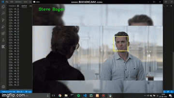

# FaceRec🎥💻👱
A Deep Learning project for face recognition from video input 

Here I used CNN architecture to train the model and took VGG16's architecture partially for building the model.
Also used haarcascade's for detecting the faces from videos with data augmentation(keras datagenerator) applied to dataset.
The whole dataset was uploaded to google drive and later directory path is navigated to script.

#### Note: Try to use Google Colab only for faster training.

#### Watch full video demo: https://www.youtube.com/watch?v=_wmBjP-Wvk4

